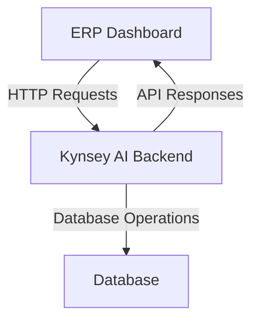

# Kynsey AI Chat Integration Documentation

This documentation provides comprehensive information about the Kynsey AI chat integration in the ERP dashboard, including user guides, technical documentation, and administrator guides.

## Table of Contents
- [User Guide](#user-guide)
- [Technical Documentation](#technical-documentation)
- [Administrator Guide](#administrator-guide)

## User Guide

### Accessing and Using the Chat Interface

To access the Kynsey AI chat interface in the ERP dashboard:
1. Navigate to the ERP dashboard in your web browser.
2. Locate the "Chat" or "Kynsey AI" section, usually found on the sidebar or within a specific tab.
3. Click on the chat icon or button to open the chat window.

### Available Commands and Features

The Kynsey AI chat supports various commands and features:
- **Help**: Type `help` to get a list of available commands.
- **Search**: Use `search [query]` to search for specific information within the ERP system.
- **Email**: Send an email using `email [recipient] [subject] [message]`.
- **Document**: Retrieve documents with `document [name]`.

### Common Use Cases and Examples

#### Example 1: Searching for a Document
```
search sales report Q4
```

#### Example 2: Sending an Email
```
email john.doe@example.com Meeting Reminder Meeting is scheduled at 3 PM.
```

#### Example 3: Retrieving a Document
```
document financial projections 2025
```

### Troubleshooting Tips

- **No Response**: Ensure your internet connection is stable and the chat server is running.
- **Command Not Found**: Type `help` to see available commands. Check for typos in your command input.
- **Authentication Issues**: Make sure you're logged into the ERP system and have the necessary permissions.

## Technical Documentation

### System Architecture Overview

The Kynsey AI integration follows a client-server architecture:
- **Frontend**: Built using React and integrated into the ERP dashboard
- **Backend**: Node.js server handling API requests and processing chat commands
- **Database**: Stores user data, documents, and system configurations



### API Endpoints and Their Purposes

| Endpoint | Method | Purpose |
|----------|--------|---------|
| `/api/search` | GET | Searches for documents within the ERP system |
| `/api/email` | POST | Sends an email to specified recipients |
| `/api/document` | GET | Retrieves specific documents |

### Integration Points with the ERP System

The Kynsey AI chat integrates with various ERP modules:
- **Document Management**: Allows searching and retrieving documents
- **Email Handling**: Facilitates sending emails directly from the chat interface
- **Search API**: Enables querying data across different ERP systems

### Configuration Options

Configuration options are managed via environment variables in `.env` files located in both frontend and backend directories.

**Frontend .env**
```
REACT_APP_API_URL=http://localhost:3001
```

**Backend .env**
```
PORT=3001
DATABASE_URL=mongodb://localhost:27017/erp
```

### Performance Considerations

- **Caching**: Implement caching strategies to reduce database load
- **Load Balancing**: Use load balancers for high traffic scenarios
- **Rate Limiting**: Implement rate limiting to prevent API abuse
- **Connection Pooling**: Use connection pools for database operations

### Browser Compatibility Notes

The Kynsey AI chat interface is compatible with:
- Google Chrome (latest version)
- Mozilla Firefox (latest version)
- Microsoft Edge (latest version)

## Administrator Guide

### Monitoring the Chat System

Monitor the Kynsey AI chat system using:
1. Server logs in `/var/log/kynsey-ai/`
2. Database monitoring tools
3. API health check endpoints
4. System metrics dashboard

### Common Issues and Resolutions

| Issue | Resolution |
|-------|------------|
| Server Down | Restart the Node.js server using `node server.js` |
| Database Connection Error | Check database URL in `.env` and ensure database service is running |
| High Memory Usage | Check for memory leaks and optimize database queries |
| Slow Response Times | Monitor API performance and optimize slow endpoints |

### System Requirements

#### Minimum Requirements
- **Node.js**: Version 14 or higher
- **MongoDB**: Version 4.0 or higher
- **RAM**: 4GB minimum
- **CPU**: 2 cores minimum
- **Storage**: 20GB minimum
- **Web Browser**: Latest versions of Chrome, Firefox, or Edge

### Maintenance Procedures

#### Daily Tasks
- Monitor system logs
- Check error rates
- Review system performance

#### Weekly Tasks
- Backup database
- Review usage statistics
- Clean up temporary files

#### Monthly Tasks
- Update dependencies
- Review security patches
- Optimize database indexes

## Support and Additional Resources

For additional support or questions:
- Email: info@greenchiptech.net
- Documentation Repository: https://github.com/kynsey-ai/docs
- Issue Tracker: https://github.com/kynsey-ai/issues